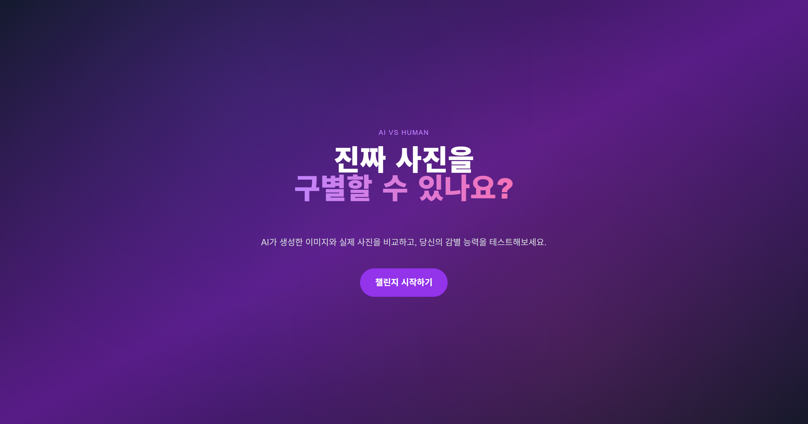
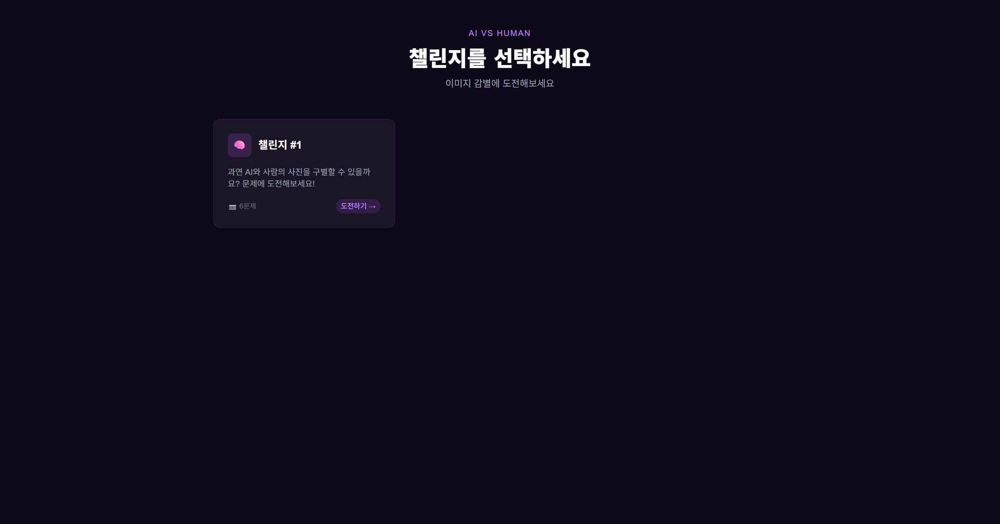
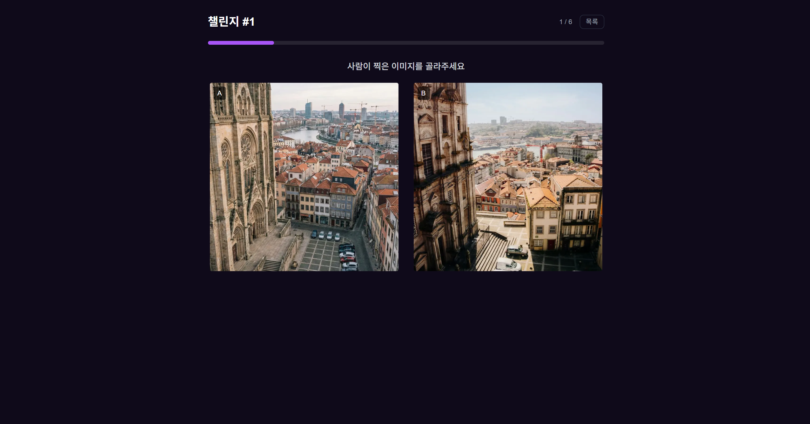
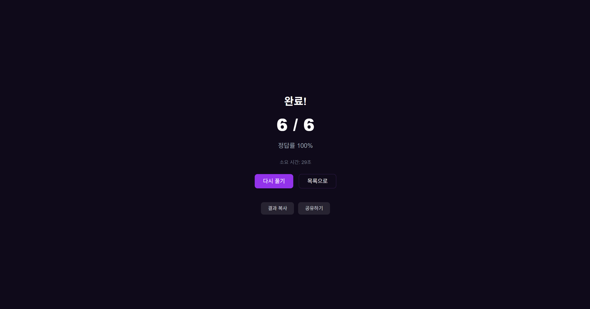
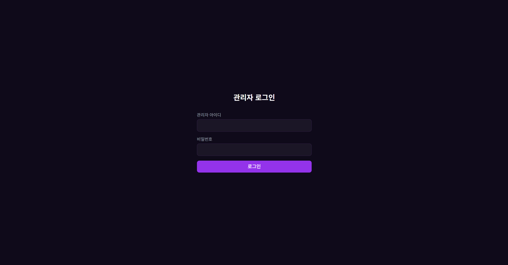
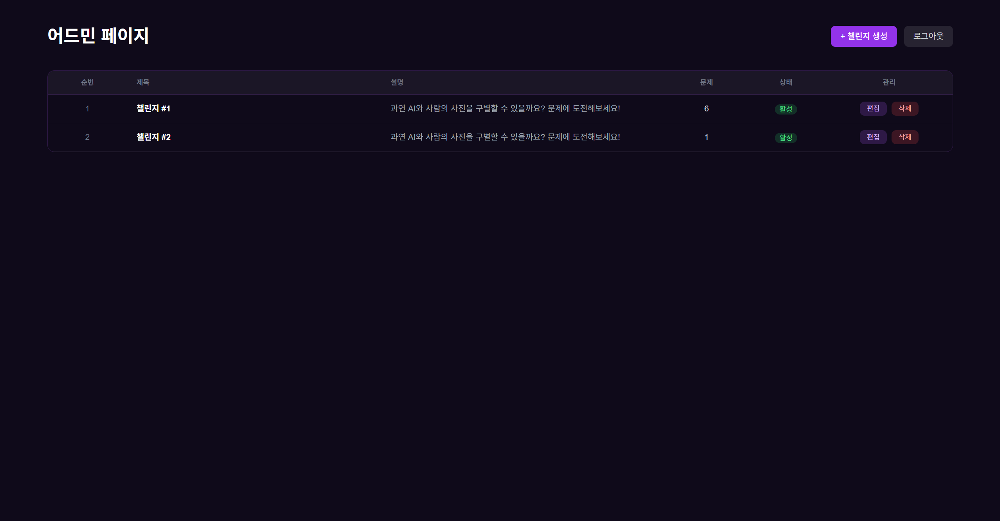
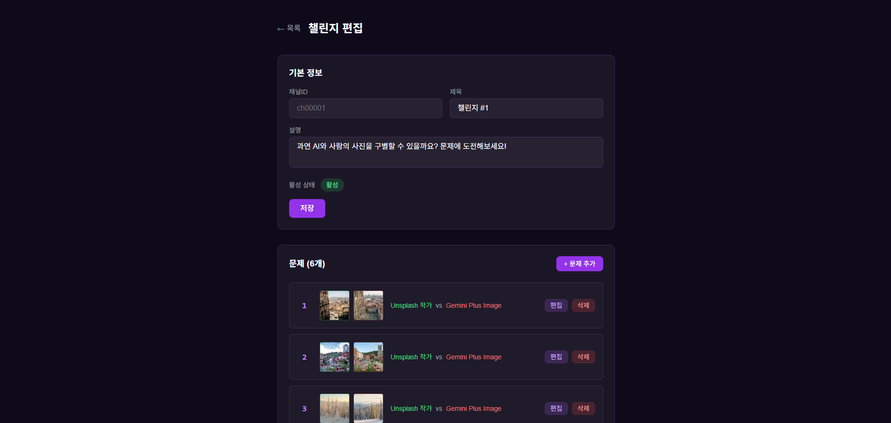
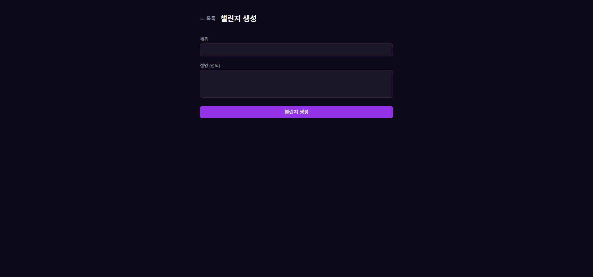

# 🤖 AI vs Human Quiz

> AI가 생성한 이미지와 실제 사진을 구별할 수 있나요?

AI 이미지 감별 퀴즈 플랫폼입니다. 두 장의 이미지 중 어떤 것이 AI가 만든 것이고, 어떤 것이 사람이 찍은 사진인지 맞혀보세요.

**[지금 플레이하기 →](https://nest-next-project-sigma.vercel.app/)**

## 스크린샷

| 인트로 | 챌린지 목록 |
|--------|------------|
|  |  |

| 퀴즈 플레이 | 결과 |
|-------------|------|
|  |  |

### 어드민 패널

| 로그인 | 대시보드 |
|--------|---------|
|  |  |

| 챌린지 편집 | 챌린지 생성 |
|-------------|------------|
|  |  |

## 기술 스택

### 백엔드 (`api/`)

| 기술 | 버전 | 용도 |
|------|------|------|
| NestJS | 11 | REST API 프레임워크 |
| Prisma | 7 | ORM |
| PostgreSQL | - | 데이터베이스 (Neon 서버리스) |
| Swagger | 11 | API 문서 자동 생성 |
| TypeScript | 5 | 언어 |

### 프론트엔드 (`web/`)

| 기술 | 버전 | 용도 |
|------|------|------|
| Next.js | 14 | React 프레임워크 (App Router) |
| React | 18 | UI 라이브러리 |
| Tailwind CSS | 3 | 스타일링 |
| TypeScript | 5 | 언어 |

## 프로젝트 구조

```
nest-next-project/
├── api/                          # 백엔드 (포트 3001)
│   ├── prisma/
│   │   ├── schema.prisma         # DB 스키마
│   │   └── migrations/           # 마이그레이션
│   └── src/
│       ├── admin/                # 어드민 모듈 (JWT 인증, CRUD)
│       │   ├── dto/              # 요청 DTO
│       │   ├── guards/           # JwtAuthGuard
│       │   ├── strategies/       # JwtStrategy
│       │   ├── admin.controller.ts
│       │   ├── admin.service.ts
│       │   └── cloudinary.service.ts
│       ├── challenges/           # 챌린지 모듈
│       ├── games/                # 게임 세션 모듈
│       ├── prisma/               # DB 연결 모듈
│       └── main.ts               # 앱 진입점
│
├── web/                          # 프론트엔드 (포트 3000)
│   └── src/
│       ├── app/
│       │   ├── admin/            # 어드민 페이지
│       │   │   ├── page.tsx      # 대시보드
│       │   │   ├── login/        # 로그인
│       │   │   └── challenges/   # 챌린지 편집
│       │   └── challenges/       # 퀴즈 페이지
│       └── components/
│           ├── admin/            # 어드민 전용 컴포넌트
│           └── ...               # 공통 컴포넌트
│
└── CLAUDE.md
```

## 주요 기능

- **AI vs Human 이미지 퀴즈** — 두 이미지 중 AI 생성 이미지를 골라내는 A/B 퀴즈
- **즉각적인 피드백** — 선택 직후 정답/오답 시각적 표시
- **점수 및 시간 기록** — 정답률과 소요 시간 측정
- **결과 공유** — 클립보드 복사 및 모바일 공유 API 지원
- **비로그인 참여** — 닉네임만 입력하면 바로 플레이 가능
- **어드민 패널** — JWT 인증 기반 챌린지/문제 관리 대시보드

## API 엔드포인트

### 퍼블릭

| 메서드 | 경로 | 설명 |
|--------|------|------|
| `GET` | `/api/challenges` | 챌린지 목록 조회 |
| `GET` | `/api/challenges/:slug` | 챌린지 상세 조회 (문제 포함) |
| `POST` | `/api/games/:slug/sessions` | 게임 세션 생성 |
| `POST` | `/api/sessions/:sessionId/answers` | 답변 제출 |
| `GET` | `/api/sessions/:sessionId/result` | 게임 결과 조회 |

### 어드민 (JWT 인증 필요)

| 메서드 | 경로 | 설명 |
|--------|------|------|
| `POST` | `/api/admin/login` | 어드민 로그인 (토큰 발급) |
| `GET` | `/api/admin/challenges` | 전체 챌린지 목록 조회 |
| `POST` | `/api/admin/challenges` | 챌린지 생성 |
| `GET` | `/api/admin/challenges/:id` | 챌린지 상세 조회 |
| `PATCH` | `/api/admin/challenges/:id` | 챌린지 수정 |
| `DELETE` | `/api/admin/challenges/:id` | 챌린지 삭제 |
| `POST` | `/api/admin/challenges/:id/questions` | 문제 추가 |
| `PATCH` | `/api/admin/questions/:id` | 문제 수정 |
| `DELETE` | `/api/admin/questions/:id` | 문제 삭제 |
| `POST` | `/api/admin/upload` | 이미지 업로드 (Cloudinary) |

Swagger 문서: `https://nest-next-project-production.up.railway.app/api/docs`

## 시작하기

### 사전 요구사항

- Node.js 18+
- PostgreSQL 데이터베이스 (또는 [Neon](https://neon.tech) 서버리스)

### 1. 저장소 클론

```bash
git clone https://github.com/<your-username>/nest-next-blog.git
cd nest-next-blog
```

> 배포된 사이트: https://nest-next-project-sigma.vercel.app/

### 2. 의존성 설치

```bash
# 백엔드
cd api && npm install

# 프론트엔드
cd ../web && npm install
```

### 3. 환경변수 설정

```bash
# api/.env
DATABASE_URL="postgresql://<user>:<password>@<host>/<database>?sslmode=require"

# 어드민 계정
ADMIN_USERNAME=admin
ADMIN_PASSWORD=your_password

# JWT
JWT_SECRET=your_jwt_secret

# Cloudinary (이미지 업로드)
CLOUDINARY_CLOUD_NAME=your_cloud_name
CLOUDINARY_API_KEY=your_api_key
CLOUDINARY_API_SECRET=your_api_secret
```

```bash
# web/.env.local
NEXT_PUBLIC_API_URL=http://localhost:3001/api
```

### 4. 데이터베이스 설정

```bash
cd api

# 마이그레이션 실행
npx prisma migrate dev

# 시드 데이터 삽입 (선택)
npx prisma db seed
```

### 5. 개발 서버 실행

```bash
# 터미널 1 — 백엔드
cd api && npm run start:dev

# 터미널 2 — 프론트엔드
cd web && npm run dev
```

백엔드: http://localhost:3001
프론트엔드: http://localhost:3000 (Next.js 기본값)

## 데이터 모델

```
Challenge (챌린지)
 └── Question (문제) — AI/Human 이미지 쌍
      └── GameAnswer (답변)

GameSession (게임 세션) — 닉네임 기반
 └── GameAnswer (답변)
```

| 모델 | 설명 |
|------|------|
| `Challenge` | 문제 세트 (slug로 식별) |
| `Question` | AI 이미지 + Human 이미지 한 쌍 |
| `GameSession` | 유저의 게임 플레이 기록 |
| `GameAnswer` | 각 문제에 대한 유저의 선택 |

## 스크립트

### 백엔드 (`api/`)

```bash
npm run start:dev     # 개발 서버 (watch 모드)
npm run build         # 프로덕션 빌드
npm run start:prod    # 프로덕션 서버
npm run test          # 단위 테스트
npm run test:e2e      # E2E 테스트
npm run lint          # ESLint
npm run format        # Prettier
```

### 프론트엔드 (`web/`)

```bash
npm run dev           # 개발 서버
npm run build         # 프로덕션 빌드
npm run start         # 프로덕션 서버
npm run lint          # ESLint
```
